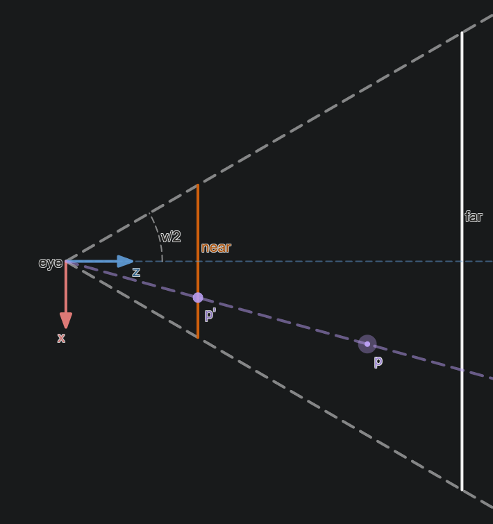

# Axis Conventions

Different tools and engines use different conventions for the axes. This is a choice that's up to the developers of those tools/engines. In the end, it really only depends on how you construct a view matrix, since that's when terms like "forward" and "up" are used as inputs. It's helpful to set a solid convention and stick with it as that makes game logic easier to reason about since most games have a fixed up-axis and a mostly flat world. Gravity will typically be along the up/down axis. Also, if your engine has a terrain heightmap, that's a wholly 2D projection, and in that case you'll certainly want those conventions to be set.

<table>
	<tr>
		<th>Blender</th>
		<th>Unreal</th>
		<th>Unity</th>
		<th>Godot</th>
	</tr>
	<tr>
		<td>Right-Handed</td>
		<td>Left-Handed</td>
		<td>Left-Handed</td>
		<td>Right-Handed</td>
	</tr>
	<tr>
		<td>X right</td>
		<td>X forward</td>
		<td>X right</td>
		<td>X left</td>
	</tr>
	<tr>
		<td>Y forward</td>
		<td>Y right</td>
		<td>Y up</td>
		<td>Y up</td>
	</tr>
	<tr>
		<td>Z up</td>
		<td>Z up</td>
		<td>Z forward</td>
		<td>Z forward</td>
	</tr>
	<tr>
		<td></td>
		<td></td>
		<td></td>
		<td></td>
	</td>
</table>

For the purposes of this document, we'll be following Blender's convention.

# 4x4 Matrices for 3D

> For the purposes of this document, we'll be using column vectors, and post-multiplication. This is to align with the conventions used in GLSL.

Generally when representing 3D transformations, we use 4x4 matrices rather than 3x3, because then it's possible to capture translation (as the 4th row or column, depending on your conventions), and they naturally allow us to use homogenous coordinates for projective geometry, which is handy for perspective projection. Within this system, our position vectors get promoted to 4D vectors with a 1 as the additional value. This 1 is important, because it applies the translation from the 4x4 matrix. If, however, you don't want translation, as is the case for normal vectors, you can use a 0, which will only apply the scaling and rotation (which are held in the 3x3 sub-matrix represented by the first 3 rows and columns of the 4x4 matrix).

Below are some figures that illustrate the above concepts.

Translation:

$$
\begin{bmatrix}
1 & 0 & 0 & x_t \\
0 & 1 & 0 & y_t \\
0 & 0 & 1 & z_t \\
0 & 0 & 0 & 1
\end{bmatrix}
\begin{bmatrix}
x_p \\
y_p \\
z_p \\
1
\end{bmatrix}=
\begin{bmatrix}
x_p + x_t \\
y_p + y_t \\
z_p + z_t \\
1
\end{bmatrix}
$$

Rotation and Translation:

$$
\begin{bmatrix}
0 & 1 & 0 & x_t \\
0 & 0 & 1 & y_t \\
1 & 0 & 0 & z_t \\
0 & 0 & 0 & 1
\end{bmatrix}
\begin{bmatrix}
x_p \\
y_p \\
z_p \\
1
\end{bmatrix}=
\begin{bmatrix}
y_p + x_t \\
z_p + y_t \\
x_p + z_t \\
1
\end{bmatrix}
$$

Scaling and Translation:

$$
\begin{bmatrix}
2 & 0 & 0 & x_t \\
0 & 3 & 0 & y_t \\
0 & 0 & 4 & z_t \\
0 & 0 & 0 & 1
\end{bmatrix}
\begin{bmatrix}
x_p \\
y_p \\
z_p \\
1
\end{bmatrix}=
\begin{bmatrix}
2x_p + x_t \\
3y_p + y_t \\
4z_p + z_t \\
1
\end{bmatrix}
$$

Rotation and Scaling without Translation:

$$
\begin{bmatrix}
0 & 2 & 0 & x_t \\
0 & 0 & 3 & y_t \\
4 & 0 & 0 & z_t \\
0 & 0 & 0 & 1
\end{bmatrix}
\begin{bmatrix}
x_p \\
y_p \\
z_p \\
0
\end{bmatrix}=
\begin{bmatrix}
2y_p \\
3z_p \\
4x_p \\
0
\end{bmatrix}
$$

# Model Space

This coordinate space represents the vertex coordinates of whatever 3D models you have as they're generally stored in 3D formats.

Conventionally, a 4x4 "model" matrix is used to represent the transformation from Model Space to World Space. This directly encodes the rotation, scale, and position of the object's origin. When applied to all the vertex positions in the model, they are put into World Space. Additionally, vertex normals and tangents are transformed either by a 3x3 matrix "trimmed" from the "model" matrix by removing the 4th row and column, or by promoting them to 4D vectors with a 0 at the end.

Given a model orientation and scale with vectors right $\vec{R}$, forward $\vec{F}$, up $\vec{U}$, and an offset $\vec{P}$, you can construct a model matrix as follows:

$$
\begin{bmatrix}
\vec{R}_x & \vec{F}_x & \vec{U}_x & \vec{P}_x \\
\vec{R}_y & \vec{F}_y & \vec{U}_y & \vec{P}_y \\
\vec{R}_z & \vec{F}_z & \vec{U}_z & \vec{P}_z \\
0 & 0 & 0 & 1
\end{bmatrix}
\begin{bmatrix}
x_p \\
y_p \\
z_p \\
1
\end{bmatrix}=
\begin{bmatrix}
\vec{R}_x x_p + \vec{F}_x y_p + \vec{U}_x z_p + \vec{P}_x \\
\vec{R}_y x_p + \vec{F}_y y_p + \vec{U}_y z_p + \vec{P}_y \\
\vec{R}_z x_p + \vec{F}_z y_p + \vec{U}_z z_p + \vec{P}_z \\
1
\end{bmatrix}
$$

# World Space

This space represents something of an "absolute" space where game logic often happens. If coordinate spaces were analogous to a number line, then World Space would represent the origin.

# View Space

This can be thought of as the space where the origin is at the "camera" or "eye", and Y+ points in the direction that the eye is pointing. This space is rotated and translated (but not scaled) from World Space using the 4x4 "view" matrix.

Given an eye with unit vectors right $\vec{R}$, forward $\vec{F}$, up $\vec{U}$, and a position $\vec{P}$, you can construct a view matrix as follows:

$$
\begin{bmatrix}
\vec{R}_x & \vec{R}_y & \vec{R}_z & 0 \\
\vec{F}_x & \vec{F}_y & \vec{F}_z & 0 \\
\vec{U}_x & \vec{U}_y & \vec{U}_z & 0 \\
0 & 0 & 0 & 1
\end{bmatrix}
\begin{bmatrix}
1 & 0 & 0 & -\vec{P}_x \\
0 & 1 & 0 & -\vec{P}_y \\
0 & 0 & 1 & -\vec{P}_z \\
0 & 0 & 0 & 1
\end{bmatrix}=
\begin{bmatrix}
\vec{R}_x & \vec{R}_y & \vec{R}_z & -\vec{R}\cdot\vec{P} \\
\vec{F}_x & \vec{F}_y & \vec{F}_z & -\vec{F}\cdot\vec{P} \\
\vec{U}_x & \vec{U}_y & \vec{U}_z & -\vec{U}\cdot\vec{P} \\
0 & 0 & 0 & 1
\end{bmatrix}
$$

# Clip Space (a.k.a. Projective Space)

This is the space you get after appyling either an "Orthographic" or "Perspective" transform. This is a Homogenous Coordinate system representing 3 dimensions using 4D vectors. These transformations are also used to apply the aspect ratio, define near and far clipping planes.

This section refers to Normalized Device Coordinates frequently. Refer to the below section to understand where some of these values are derived from. That section is placed below because that makes sense chronologically.

> In graphics APIs, there is a fixed-function step that happens right before Rasterization called Vertex Post-Processing where a number of transformations are made. The main one of concern here is *Perspective Division*.

$$
\text{Given a Clip Space vertex }
\begin{bmatrix}
x \\ y \\ z \\ w \\
\end{bmatrix}
\text{ Normalized Device Coordinates are calculated as }
\begin{bmatrix}
x/w \\ y/w \\ z/w \\
\end{bmatrix}
$$

This enables us to express a Perspective transform as a 4x4 matrix that converts from Euclidean Coordinates to Homogenous without having to manually convert back afterwards. It's also at this point that you typically correct for the screen's aspect ratio and the near/far clipping planes.

Conceptually these transforms are made up of a few pieces, since their job is to get from View Space to Normalized Device Coordinates while regarding the rules of Perspective Division. Since NDCs are different for different APIs, the resulting transformations must be altered slightly. Given we've defined our View transform with Z up and Y forward (and that doesn't match NDC for any API), we define a transformation to get us to the desired basis and range.

Given target basis vectors right $\vec{R}$, forward $\vec{F}$, up $\vec{U}$ which are defined as the NDC directions in the Z-up space we've chosen, we derive the change of basis as:

$$
\begin{bmatrix}
\vec{R}_x & \vec{F}_x & \vec{U}_x & 0 \\
\vec{R}_y & \vec{F}_y & \vec{U}_y & 0 \\
\vec{R}_z & \vec{F}_z & \vec{U}_z & 0 \\
0 & 0 & 0 & 1
\end{bmatrix}
$$

Which gives us:

$$
\begin{aligned}
\text{Change of Basis Matrices For The 4 Main Graphics APIs} \\
\begin{array}{ccc}
\hline
\text{OpenGL} & \text{Vulkan} & \text{DirectX + Metal} \\
\begin{bmatrix}
1 & 0 & 0 & 0 \\
0 & 0 & 1 & 0 \\
0 & 1 & 0 & 0 \\
0 & 0 & 0 & 1 \\
\end{bmatrix}
&
\begin{bmatrix}
1 & 0 & 0 & 0 \\
0 & 0 &-1 & 0 \\
0 & 1 & 0 & 0 \\
0 & 0 & 0 & 1 \\
\end{bmatrix}
&
\begin{bmatrix}
1 & 0 & 0 & 0 \\
0 & 0 & 1 & 0 \\
0 & 1 & 0 & 0 \\
0 & 0 & 0 & 1 \\
\end{bmatrix}
\end{array}
\end{aligned}
$$

For Vulkan, DirectX, and Metal, we already have the correct range, but for OpenGL we need to scale and offset in the Z direction:

$$
\begin{bmatrix}
1 & 0 & 0 & 0 \\
0 & 1 & 0 & 0 \\
0 & 0 & 2 &-1 \\
0 & 0 & 0 & 1 \\
\end{bmatrix}*
\text{Projective Transform}*
\begin{bmatrix}
1 & 0 & 0 & 0 \\
0 & 0 & 1 & 0 \\
0 & 1 & 0 & 0 \\
0 & 0 & 0 & 1 \\
\end{bmatrix}=
\text{Final View Space to Clip Space Transform}
$$

### Orthographic

An orthographic projection is a linear transformation that's defined simply as how large of a space our viewport represents. We're typically given a width ($w$), height ($h$), and near ($n$) and far ($f$) clipping planes. From right to left, we have the final result, our change of basis from our tool to the API, the orthographic transform, and finally a scale/offset (which is the identity matrix for all APIs except OpenGL due to its unusual NDC $z$ range).

$$
\begin{bmatrix}
1 & 0 & 0 & 0 \\
0 & 1 & 0 & 0 \\
0 & 0 & 1 & 0 \\
0 & 0 & 0 & 1 \\
\end{bmatrix}
\begin{bmatrix}
\frac{2}{w} & 0 & 0 & 0 \\
0 & \frac{2}{h} & 0 & 0 \\
0 & 0 & \frac{1}{f-n} & \frac{f+n}{f-n} \\
0 & 0 & 0 & 1 \\
\end{bmatrix}
\begin{bmatrix}
1 & 0 & 0 & 0 \\
0 & 0 &-1 & 0 \\
0 & 1 & 0 & 0 \\
0 & 0 & 0 & 1 \\
\end{bmatrix}=
\begin{bmatrix}
\frac{2}{w} & 0 & 0 & 0 \\
0 & 0 & -\frac{2}{h} & 0 \\
0 & \frac{1}{f-n} & 0 & \frac{f+n}{f-n} \\
0 & 0 & 0 & 1 \\
\end{bmatrix}
$$

### Perspective

A perspective projection takes advantage of the perspective divide to create the 3D effect where objects further away appear smaller. We're typically given a vertical or horizontal viewing angle called the Field of View ($v$), as well as an aspect ratio ($r$) and near ($n$) and far ($f$) clipping planes.

$p'$ is simply calculated as $\frac{p}{p_z}$. To take advantage of this in matrix form, we rely on the Perspective Divide step and place our $z$ component into the $w$ component of our resulting vector.

$$
\begin{bmatrix}
1 & 0 & 0 & 0 \\
0 & 1 & 0 & 0 \\
0 & 0 & 1 & 0 \\
0 & 0 & 1 & 0 \\
\end{bmatrix}
\begin{bmatrix}
x \\
y \\
z \\
1
\end{bmatrix}=
\begin{bmatrix}
x \\
y \\
z \\
z
\end{bmatrix}
\Rightarrow
\text{Perspective Divide}
\Rightarrow
\begin{bmatrix}
x/z \\
y/z \\
z/z \\
1
\end{bmatrix}
$$

You'll notice that it's not actually this simple because our near plane represents the screen, which intersects the origin in NDC, which is clearly not happening in this diagram, and there's the matter of scaling the space to cover the distance between our near and far planes. Also, $z/z = 1$, which means the only possible depth value is 1, and that would break depth testing.

So first we're going to offset such that the origin is on the near plane (offsetting the origin is the opposite action to offsetting a point, so we use $-n$ here), and then scale the space such that the distance between the near and far plane is 1. While we're at it, we'll scale the width and height to match our Field of View and Aspect Ratio.

We're going to use a horizontal Field of View and define our aspect ratio $r = w/h$

From $v$ we calculate our focal length $l = tan(\frac{v}{2})$

$$
\begin{bmatrix}
\frac{1}{l} & 0 & 0 & 0 \\
0 & \frac{r}{l} & 0 & 0 \\
0 & 0 & \frac{1}{f-n} & 0 \\
0 & 0 & 0 & 1 \\
\end{bmatrix}
\begin{bmatrix}
1 & 0 & 0 & 0 \\
0 & 1 & 0 & 0 \\
0 & 0 & 1 &-n \\
0 & 0 & 0 & 1 \\
\end{bmatrix}=
\begin{bmatrix}
\frac{1}{l} & 0 & 0 & 0 \\
0 & \frac{r}{l} & 0 & 0 \\
0 & 0 & \frac{1}{f-n} & -\frac{n}{f-n} \\
0 & 0 & 0 & 1 \\
\end{bmatrix}
$$

It's at this point we have to factor in the Perspective Divide, so we modify our matrix such that the original $z$ coordinate gets put into the $w$ component unmodified.

$$
\begin{bmatrix}
\frac{1}{l} & 0 & 0 & 0 \\
0 & \frac{r}{l} & 0 & 0 \\
0 & 0 & \frac{1}{f-n} & -\frac{n}{f-n} \\
0 & 0 & 1 & 0 \\
\end{bmatrix}
\begin{bmatrix}
x \\
y \\
z \\
1
\end{bmatrix}=
\begin{bmatrix}
\frac{x}{l} \\
\frac{ry}{l} \\
\frac{z - n}{f-n} \\
z
\end{bmatrix}
\Rightarrow
\text{Perspective Divide}
\Rightarrow
\begin{bmatrix}
\frac{x}{l}/z \\
\frac{ry}{l}/z \\
\frac{z - n}{f-n}/z \\
1
\end{bmatrix}
$$

But wait, we modified our bounds *before* the Perspective Divide, but now they have changed by a factor of $z$. This is a simple fix, and all we need to do is multiply by the distance to the far plane, since that's our upper bound.

$$
\begin{bmatrix}
1 & 0 & 0 & 0 \\
0 & 1 & 0 & 0 \\
0 & 0 & f & 0 \\
0 & 0 & 0 & 1 \\
\end{bmatrix}
\begin{bmatrix}
\frac{1}{l} & 0 & 0 & 0 \\
0 & \frac{r}{l} & 0 & 0 \\
0 & 0 & \frac{1}{f-n} & -\frac{n}{f-n} \\
0 & 0 & 1 & 0 \\
\end{bmatrix}=
\begin{bmatrix}
\frac{1}{l} & 0 & 0 & 0 \\
0 & \frac{r}{l} & 0 & 0 \\
0 & 0 & \frac{f}{f-n} & -\frac{fn}{f-n} \\
0 & 0 & 1 & 0 \\
\end{bmatrix}
$$

Now, we've completed the projection part of the projection matrix, but we've assumed we're in a space like Vulkan or DirectX's NDC, so we need to transform into such a space first. From right to left, we have the final result, our change of basis from our tool to the API, the above derived projection transform, and finally a scale/offset (which is the identity matrix for all APIs except OpenGL due to its unusual NDC $z$ range).

Here is the final result for our X-right, Y-forward, Z-up tool using Vulkan:

$$
\begin{bmatrix}
1 & 0 & 0 & 0 \\
0 & 1 & 0 & 0 \\
0 & 0 & 1 & 0 \\
0 & 0 & 0 & 1 \\
\end{bmatrix}
\begin{bmatrix}
\frac{1}{l} & 0 & 0 & 0 \\
0 & \frac{r}{l} & 0 & 0 \\
0 & 0 & \frac{f}{f-n} & -\frac{fn}{f-n} \\
0 & 0 & 1 & 0 \\
\end{bmatrix}
\begin{bmatrix}
1 & 0 & 0 & 0 \\
0 & 0 &-1 & 0 \\
0 & 1 & 0 & 0 \\
0 & 0 & 0 & 1 \\
\end{bmatrix}=
\begin{bmatrix}
\frac{1}{l} & 0 & 0 & 0 \\
0 & 0 & -\frac{r}{l} & 0 \\
0 & \frac{f}{f-n} & 0 & -\frac{fn}{f-n} \\
0 & 1 & 0 & 0 \\
\end{bmatrix}
$$

# Normalized Device Coordinates

> The images here are presented with a 16:9 aspect ratio where the orange rectangle represents the screen (where a depth of 0 would be written to the depth buffer).

<table>
	<tr>
		<th>OpenGL</th>
		<th>Vulkan</th>
		<th>DirectX + Metal</th>
	</tr>
	<tr>
		<td>Left-Handed</td>
		<td>Right-Handed</td>
		<td>Left-Handed</td>
	</tr>
	<tr style="padding: 0; margin: 0;">
		<td style="padding: 0; margin: 0;"><table style="margin: 0; padding: 0; width: 100%;">
			<tr>
				<td style="width: 33.3%;">X</td>
				<td style="width: 33.3%; text-align: center;">Right</td>
				<td style="width: 33.3%; text-align: right;">-1 to 1</td>
			</tr>
			<tr>
				<td style="width: 33.3%;">Y</td>
				<td style="width: 33.3%; text-align: center;">Up</td>
				<td style="width: 33.3%; text-align: right;">-1 to 1</td>
			</tr>
			<tr>
				<td style="width: 33.3%;">Z</td>
				<td style="width: 33.3%; text-align: center;">Forward</td>
				<td style="width: 33.3%; text-align: right;">-1 to 1</td>
			</tr>
		</table></td>
		<td style="padding: 0; margin: 0;"><table style="margin: 0; padding: 0; width: 100%;">
			<tr>
				<td style="width: 33.3%;">X</td>
				<td style="width: 33.3%; text-align: center;">Right</td>
				<td style="width: 33.3%; text-align: right;">-1 to 1</td>
			</tr>
			<tr>
				<td style="width: 33.3%;">Y</td>
				<td style="width: 33.3%; text-align: center;">Down</td>
				<td style="width: 33.3%; text-align: right;">-1 to 1</td>
			</tr>
			<tr>
				<td style="width: 33.3%;">Z</td>
				<td style="width: 33.3%; text-align: center;">Forward</td>
				<td style="width: 33.3%; text-align: right;">0 to 1</td>
			</tr>
		</table></td>
		<td style="padding: 0; margin: 0;"><table style="margin: 0; padding: 0; width: 100%;">
			<tr>
				<td style="width: 33.3%;">X</td>
				<td style="width: 33.3%; text-align: center;">Right</td>
				<td style="width: 33.3%; text-align: right;">-1 to 1</td>
			</tr>
			<tr>
				<td style="width: 33.3%;">Y</td>
				<td style="width: 33.3%; text-align: center;">Up</td>
				<td style="width: 33.3%; text-align: right;">-1 to 1</td>
			</tr>
			<tr>
				<td style="width: 33.3%;">Z</td>
				<td style="width: 33.3%; text-align: center;">Forward</td>
				<td style="width: 33.3%; text-align: right;">0 to 1</td>
			</tr>
		</table></td>
	</tr>
	<tr>
		<td></td>
		<td></td>
		<td></td>
	</tr>
</table>

